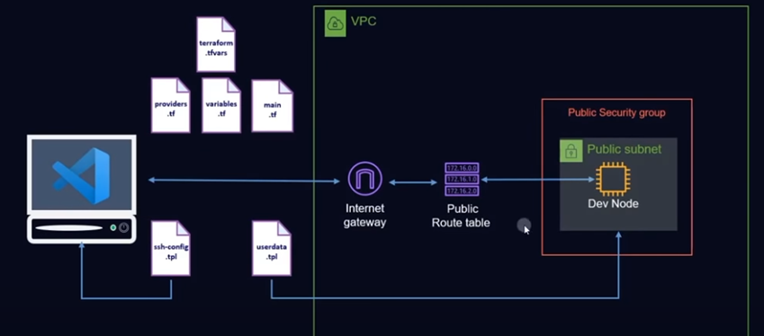

# Build a dev environment by using terraform

## Create a user in IAM  - vscode

## Insert access credentials to VS code for AWS access
### Install extentions for AWS, and terraform in VS Code
### Go to View-->Command Platte --> AWS: Create credential profile --> fill in access key and Secret key --> save

## Build a dev environment
